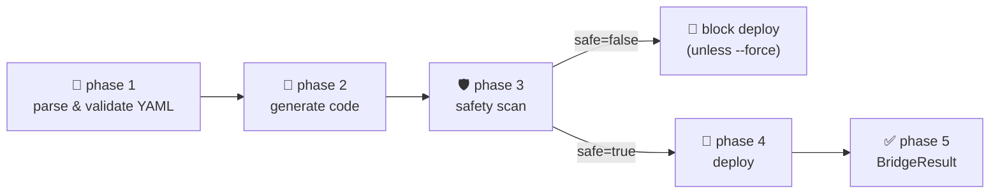

<!-- markdownlint-disable MD033 -->

<div align="center">

# Grok Build Bridge

[](https://pypi.org/project/grok-build-bridge/)
[](LICENSE)
[](https://www.python.org/downloads/)
[](https://x.ai)
[](https://x.ai)
[](#)

**One YAML. Grok builds it. Safely on X.**

</div>

<p align="center">
  
</p>

<p align="center">
  <a href="#60-second-quick-start"><strong>🚀 Quick Start</strong></a>
  &nbsp;·&nbsp;
  <a href="#templates"><strong>📚 Templates</strong></a>
</p>

---

## Why Bridge exists

- **Grok 4.20 can already write the agent — somebody just has to ship it.** Bridge closes the last mile between "Grok generated my code" and "agent is live on X posting every 6 hours."
- **Safety is not optional.** Every run statically scans the generated code for secrets / shell injection / infinite loops, and runs a second Grok-in-the-loop audit before the agent ever reaches the public timeline.
- **One YAML, zero glue.** You describe the agent once — source mode, tools, schedule, safety limits, deploy target — and the CLI runs the rest. No Terraform, no Procfile, no per-host deploy script.

## 60-second Quick Start

```bash
# 1. Install (Python 3.10+)
pip install grok-build-bridge

# 2. Scaffold a ready-to-run template
grok-build-bridge init x-trend-analyzer
#   + bridge.yaml

# 3. Dry-run the full pipeline — no API keys needed for this step
grok-build-bridge run bridge.yaml --dry-run

# 4. Set your key and ship it for real
export XAI_API_KEY=sk-...
export X_BEARER_TOKEN=...
grok-build-bridge run bridge.yaml
```

Five phase headers scroll past, a green **✅ Bridge complete** panel prints, and your agent is live.

## The YAML

One file. Every knob. Nothing implicit:

```yaml
version: "1.0"
name: x-trend-analyzer
description: Every 6 hours, summarise the top 5 technical trends on X with primary-source citations.

build:
  source: grok                   # stream the implementation from Grok
  language: python
  entrypoint: main.py
  required_tools:
    - x_search
    - web_search
  grok_prompt: |
    Generate ONE Python 3.11 file that polls x_search for trending AI
    topics, verifies each with web_search, and publishes one thread...

deploy:
  target: x                      # hand off to grok-install's deploy_to_x
  post_to_x: true
  schedule: "0 */6 * * *"        # every 6 hours
  safety_scan: true

agent:
  model: grok-4.20-0309          # pinned; enum-validated
  reasoning_effort: medium
  personality: Neutral, factual, citation-first.

safety:
  audit_before_post: true        # Grok audits the post before it fires
  max_tokens_per_run: 18000      # hard ceiling — runaway loops can't burn your budget
  lucas_veto_enabled: false      # Orchestra enables this; Bridge defaults off
```

VS Code autocompletes every key — see [`docs/vscode-integration.md`](docs/vscode-integration.md).

## What it does under the hood



- **Phase 1 — Parse:** strict Draft 2020-12 schema, defaults filled, result frozen.
- **Phase 2 — Generate:** streams `grok-4.20-0309` via the official `xai-sdk`, extracts a fenced code block, writes `bridge.manifest.json`.
- **Phase 3 — Safety:** regex-driven static sweep + a JSON-mode Grok audit, merged into one `SafetyReport`.
- **Phase 4 — Deploy:** dispatches on `deploy.target` — `x` (via `grok_install.runtime.deploy_to_x`), `vercel`, `render`, or `local`. X-bound posts get a pre-flight `audit_x_post`.
- **Phase 5 — Summary:** a green Rich panel with the generated path, safety verdict, deploy URL, duration, and token estimate.

## Templates

`grok-build-bridge templates` lists the five certified templates that ship in the wheel:

| Slug | What it does | Source mode | Required env |
| --- | --- | --- | --- |
| [`x-trend-analyzer`](grok_build_bridge/templates/x-trend-analyzer.yaml) | Every 6 hours → one thread summarising the top 5 trends with primary-source citations. | `grok` | `XAI_API_KEY`, `X_BEARER_TOKEN` |
| [`truthseeker-daily`](grok_build_bridge/templates/truthseeker-daily.yaml) | Daily fact-check of the 3 most-discussed threads in a domain, with a calibration note. | `grok` | `XAI_API_KEY`, `X_BEARER_TOKEN` |
| [`code-explainer-bot`](grok_build_bridge/templates/code-explainer-bot.yaml) | Point at a Python repo via `$TARGET_REPO` → plain-English explainer thread. | `local` | `TARGET_REPO`, `XAI_API_KEY`, `X_BEARER_TOKEN` |
| [`grok-build-coding-agent`](grok_build_bridge/templates/grok-build-coding-agent.yaml) | Tiny TypeScript CLI via the `grok-build-cli` → `grok` fallback chain. | `grok-build-cli` | `XAI_API_KEY` |
| [`research-thread-weekly`](grok_build_bridge/templates/research-thread-weekly.yaml) | Weekly deep-research: 5 parallel queries + web verification → one authoritative thread. | `grok` | `XAI_API_KEY`, `X_BEARER_TOKEN` |

Scaffold any of them with `grok-build-bridge init <slug>`.

## Safety

Two layers between Grok-generated code and the public timeline.

**Layer 1 — Static sweep.** Compiled regex catalog flags hardcoded AWS / xAI / OpenAI / GitHub keys, `eval()` / `exec()`, unbounded `while True`, `subprocess(..., shell=True)`, `os.system`, `requests` calls without `timeout=`, and `pickle.load` / `yaml.load` without `SafeLoader`. Every finding carries a short slug (`shell-call:`, `hardcoded-secret:`, `no-timeout:`, …) that downstream tooling can key on.

**Layer 2 — Grok-in-the-loop audit.** `grok-4.20-0309` reviews the produced file in strict JSON mode for X API abuse, rate-limit risk, misinformation risk, PII exposure, and infinite-loop risk. The two layers merge into a frozen [`SafetyReport`](grok_build_bridge/safety.py). A failing scan blocks the deploy unless you pass `--force`.

**Lucas veto (preview).** Bridge leaves `safety.lucas_veto_enabled` off by default. The flag is wired for [Orchestra](ROADMAP.md) — the multi-agent sibling project — where a named Lucas agent holds a veto on anything that reaches X. You will hear more in the next 30 days.

## xAI Alignment

Bridge is 100% additive to xAI's mission — it exists to make **more people ship more Grok 4.20 agents, safely.** Every model call goes through the official [`xai-sdk`](https://github.com/xai-org/xai-sdk-python) using enum-pinned model ids (`grok-4.20-0309` / `grok-4.20-multi-agent-0309`); no fallbacks, no wrappers that could drift from xAI's intended behaviour. The only deploy glue Bridge touches is the companion [`grok-install-ecosystem`](https://github.com/AgentMindCloud/grok-install-ecosystem) — an Apache-2.0 community layer that xAI can adopt, fork, or replace at any time.

## Roadmap (next 30 days)

- [ ] **Week 1 — Orchestra teaser.** Multi-agent companion project drops. Named Lucas veto becomes the first external user of Bridge's `lucas_veto_enabled` flag.
- [ ] **Week 2 — First-class X observability.** Per-agent dashboards (posts/day, audit-blocks, token burn) rendered to the CLI and emitted as Prometheus on request.
- [ ] **Week 3 — Official Grok-install action.** Replace the `grok_install.runtime.deploy_to_x` fallback stub with a maintained GitHub Action.
- [ ] **Week 4 — Batch mode.** `grok-build-bridge run *.bridge.yaml` for operators who manage ten agents at once.
- [ ] **Week 4 — v0.2.0 on PyPI.** Tagged release via the trusted-publishing pipeline already live on `main`.

Full plan in [`ROADMAP.md`](ROADMAP.md).

## Contributing

Dev install, branching, commit style, and the PR checklist live in [`CONTRIBUTING.md`](CONTRIBUTING.md). In short:

```bash
git clone https://github.com/AgentMindCloud/grok-build-bridge.git
cd grok-build-bridge
python -m venv .venv && source .venv/bin/activate
pip install -e ".[dev]"
ruff check . && ruff format --check . && mypy grok_build_bridge && pytest
```

## License

Apache 2.0 — see [`LICENSE`](LICENSE). Copyright © 2026 Jan Solo / AgentMindCloud.

## Credits

- The **xAI team** for Grok 4.20 and the official `xai-sdk` Python client.
- The **`grok-install-ecosystem`** community for the `deploy_to_x` glue Bridge builds on.
- Every early user who filed a good bug report. Threads are a finite resource — thanks for spending one on us.
