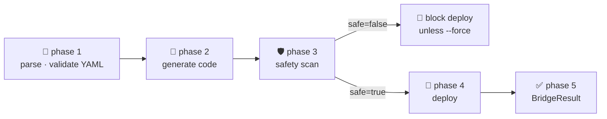
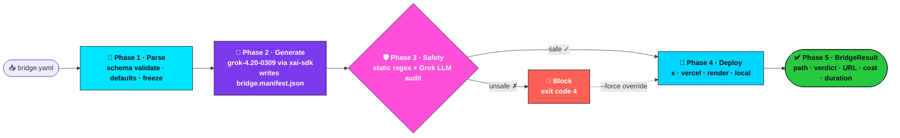

<!-- NEON / CYBERPUNK REPO TEMPLATE · GROK-BUILD-BRIDGE -->

<p align="center">
  
</p>

<h1 align="center">⚡ grok-build-bridge</h1>

<p align="center">
  <a href="https://pypi.org/project/grok-build-bridge/"></a>
  <a href="https://github.com/AgentMindCloud/grok-build-bridge/releases"></a>
  <a href="https://github.com/AgentMindCloud/grok-build-bridge/actions/workflows/ci.yml"></a>
  <a href="https://www.python.org/downloads/"></a>
  <a href="LICENSE"></a>
  <a href="https://github.com/AgentMindCloud/grok-agent-orchestra"></a>
</p>

<p align="center">
  <b>The last mile from "Grok generated my code" to "agent is live on X posting every 6 hours."</b><br/>
  One YAML. Codegen. Safety audit. Deploy. Zero glue.
</p>

<p align="center">
  
</p>

<p align="center">
  
  <a href="LICENSE"></a>
  <a href="https://www.python.org/downloads/"></a>
  <a href="https://x.ai"></a>
  <a href="https://x.ai"></a>
  
</p>

<p align="center">

<svg xmlns="http://www.w3.org/2000/svg" viewBox="0 0 720 300" width="720">
  <rect width="720" height="300" fill="#0A0D14" rx="10"/>
  <rect width="720" height="32" fill="#0F1420" rx="10"/>
  <rect y="24" width="720" height="8" fill="#0F1420"/>
  <circle cx="16" cy="16" r="5" fill="#FF5F56"/>
  <circle cx="36" cy="16" r="5" fill="#FFBD2E"/>
  <circle cx="56" cy="16" r="5" fill="#27C93F"/>
  <text x="320" y="21" fill="#8899A6" font-family="monospace" font-size="12">zsh · grok-build-bridge</text>
  <text x="24" y="70" fill="#00E5FF" font-family="monospace" font-size="14">$</text>
  <text x="44" y="70" fill="#EAF8FF" font-family="monospace" font-size="14">grok-build-bridge run bridge.yaml</text>
  <line x1="24" y1="86" x2="696" y2="86" stroke="#556677" stroke-opacity="0.3"/>
  <text x="24" y="112" fill="#00E5FF" font-family="monospace" font-size="12" font-weight="700">▸ phase 1</text>
  <text x="108" y="112" fill="#EAF8FF" font-family="monospace" font-size="12">parse · validate YAML</text>
  <text x="640" y="112" fill="#27C93F" font-family="monospace" font-size="11" font-weight="700">✓ 0.02s</text>
  <text x="24" y="136" fill="#7C3AED" font-family="monospace" font-size="12" font-weight="700">▸ phase 2</text>
  <text x="108" y="136" fill="#EAF8FF" font-family="monospace" font-size="12">generate · grok-4.20-0309</text>
  <rect x="380" y="126" width="180" height="12" fill="#12161F" stroke="#7C3AED" stroke-opacity="0.4" rx="2"/>
  <rect x="380" y="126" width="180" height="12" fill="#7C3AED" fill-opacity="0.5"><animate attributeName="width" values="0;180" dur="2s" repeatCount="indefinite"/></rect>
  <text x="640" y="136" fill="#7C3AED" font-family="monospace" font-size="11" font-weight="700">17.4k tok</text>
  <text x="24" y="160" fill="#FF4FD8" font-family="monospace" font-size="12" font-weight="700">▸ phase 3</text>
  <text x="108" y="160" fill="#EAF8FF" font-family="monospace" font-size="12">safety scan · static + grok audit</text>
  <text x="640" y="160" fill="#27C93F" font-family="monospace" font-size="11" font-weight="700">✓ SAFE</text>
  <text x="24" y="184" fill="#00D5FF" font-family="monospace" font-size="12" font-weight="700">▸ phase 4</text>
  <text x="108" y="184" fill="#EAF8FF" font-family="monospace" font-size="12">deploy · target=x · schedule=0 */6 * * *</text>
  <text x="640" y="184" fill="#27C93F" font-family="monospace" font-size="11" font-weight="700">✓ LIVE</text>
  <text x="24" y="208" fill="#5EF2FF" font-family="monospace" font-size="12" font-weight="700">▸ phase 5</text>
  <text x="108" y="208" fill="#EAF8FF" font-family="monospace" font-size="12">BridgeResult</text>
  <text x="640" y="208" fill="#27C93F" font-family="monospace" font-size="11" font-weight="700">✓ 42.7s</text>
  <line x1="24" y1="228" x2="696" y2="228" stroke="#556677" stroke-opacity="0.3"/>
  <rect x="24" y="244" width="672" height="40" fill="#27C93F" fill-opacity="0.1" stroke="#27C93F" stroke-opacity="0.5" rx="4"/>
  <text x="40" y="269" fill="#27C93F" font-family="monospace" font-size="13" font-weight="700">✅ BRIDGE COMPLETE</text>
  <text x="220" y="269" fill="#EAF8FF" font-family="monospace" font-size="11">x-trend-analyzer · deployed to X · audit = passed · tokens = 17,412</text>
</svg>

</p>

<p align="center">
  <a href="#-60-second-quick-start"><b>🚀 Quick Start</b></a> ·
  <a href="#-templates"><b>📚 Templates</b></a> ·
  <a href="#-safety"><b>🛡️ Safety</b></a> ·
  <a href="#-roadmap"><b>🗺️ Roadmap</b></a>
</p>

---

## ✦ Why Bridge Exists

<table>
  <tr>
    <td width="33%">
      <h3>🎯 Close the Last Mile</h3>
      <p>Grok 4.20 can already write the agent — somebody just has to ship it. Bridge closes the gap between "Grok generated my code" and "agent is live on X posting every 6 hours."</p>
    </td>
    <td width="33%">
      <h3>🛡️ Safety Isn't Optional</h3>
      <p>Every run statically scans generated code for secrets / shell injection / infinite loops, and runs a second Grok-in-the-loop audit before the agent touches the public timeline.</p>
    </td>
    <td width="33%">
      <h3>⚡ One YAML, Zero Glue</h3>
      <p>You describe the agent once — source mode, tools, schedule, safety limits, deploy target. The CLI runs the rest. No Terraform, no Procfile, no per-host deploy scripts.</p>
    </td>
  </tr>
</table>

## ✦ 60-Second Quick Start

```bash
# 1. Install (Python 3.10+)
pip install grok-build-bridge

# 2. Scaffold a ready-to-run template
grok-build-bridge init x-trend-analyzer
#   + bridge.yaml

# 3. Dry-run the full pipeline — no API keys needed for this step
grok-build-bridge run bridge.yaml --dry-run

# 4. Set your key and ship it for real
export XAI_API_KEY=sk-...
export X_BEARER_TOKEN=...
grok-build-bridge run bridge.yaml
```

Five phase headers scroll past, a green **✅ Bridge complete** panel prints, and your agent is live.

## ✦ The YAML

One file. Every knob. Nothing implicit:

```yaml
version: "1.0"
name: x-trend-analyzer
description: Every 6 hours, summarise the top 5 technical trends on X with primary-source citations.

build:
  source: grok                   # stream the implementation from Grok
  language: python
  entrypoint: main.py
  required_tools:
    - x_search
    - web_search
  grok_prompt: |
    Generate ONE Python 3.11 file that polls x_search for trending AI
    topics, verifies each with web_search, and publishes one thread...

deploy:
  target: x                      # hand off to grok-install's deploy_to_x
  post_to_x: true
  schedule: "0 */6 * * *"        # every 6 hours
  safety_scan: true

agent:
  model: grok-4.20-0309          # pinned; enum-validated
  reasoning_effort: medium
  personality: Neutral, factual, citation-first.

safety:
  audit_before_post: true        # Grok audits the post before it fires
  max_tokens_per_run: 18000      # hard ceiling — runaway loops can't burn your budget
  lucas_veto_enabled: false      # Orchestra enables this; Bridge defaults off
```

VS Code autocompletes every key — see [`docs/vscode-integration.md`](docs/vscode-integration.md).

## ✦ The Five Phases



<table>
  <tr>
    <td width="50%">
      <h3>📄 Phase 1 · Parse</h3>
      <p>Strict Draft 2020-12 schema, defaults filled, result frozen. No guessing.</p>
    </td>
    <td width="50%">
      <h3>🎯 Phase 2 · Generate</h3>
      <p>Streams <code>grok-4.20-0309</code> via official <code>xai-sdk</code>. Extracts a fenced code block. Writes <code>bridge.manifest.json</code> (name · model · prompt sha-256 · token estimate · file list).</p>
    </td>
  </tr>
  <tr>
    <td>
      <h3>🛡️ Phase 3 · Safety</h3>
      <p>Regex static sweep + JSON-mode Grok audit, merged into one <code>SafetyReport</code>.</p>
    </td>
    <td>
      <h3>🚀 Phase 4 · Deploy</h3>
      <p>Dispatches on <code>deploy.target</code>: <code>x</code> · <code>vercel</code> · <code>render</code> · <code>local</code>. X-bound posts get a pre-flight <code>audit_x_post</code>.</p>
    </td>
  </tr>
  <tr>
    <td colspan="2">
      <h3>✅ Phase 5 · Summary</h3>
      <p>Green Rich panel: generated path · safety verdict · deploy URL · duration · token estimate.</p>
    </td>
  </tr>
</table>

**Resilience:** transient xAI failures (rate limits, connection resets, timeouts) are retried under tenacity — 3 attempts, exponential backoff clamped to 2–16 s. `ToolExecutionError` retries once with tools disabled before surfacing.

### ✦ End-to-End Flow



The full pipeline executes in **~40 seconds** for a typical agent. Every edge above is enforced by typed contracts — a phase cannot silently skip the next.

### ✦ Before vs After

| Aspect | Before Bridge | After Bridge |
| --- | --- | --- |
| ⏱️ **Time to first deploy** | Days — write the code, hand-roll deploy scripts, debug X auth, wire cron. | Minutes — `grok-build-bridge run bridge.yaml`. |
| 📄 **Configuration** | Many files: source, deploy script, cron, secrets, retry glue. | One YAML, schema-validated, defaults filled, frozen at parse time. |
| 🛡️ **Safety review** | Manual code reading, or skipped under deadline pressure. | Two-layer audit (static regex + Grok LLM) on every run. **Fails closed.** |
| 🚀 **Multi-target deploy** | Rewrite glue per host (X / Vercel / Render / local). | One `deploy.target` switch. Same agent, four destinations. |
| 💰 **Cost ceiling** | Unbounded — a runaway loop drains the xAI budget overnight. | `safety.max_tokens_per_run` caps every run; bridge aborts before overspend. |
| 🔁 **Iteration loop** | Slow — full deploy required to test changes. | `--dry-run` exercises parse → generate → safety without touching prod. |
| ✅ **Reproducibility** | "Works on my laptop" — model + prompt drift between runs. | `bridge.manifest.json` pins model · prompt SHA-256 · token estimate · file list. |
| 🚨 **Failure modes** | Stack traces, broken deploys, posted bugs that need takedown. | Branded panels + typed exit codes (`2` config · `3` runtime · `4` safety). Nothing reaches X on failure. |
| 🎼 **Orchestra / Lucas integration** | Custom glue per project, brittle, no audit trail. | `safety.lucas_veto_enabled: true` — one line, durable, reviewable. |

Bottom line: **what used to take a week of glue code, manual safety review, and brittle deploy scripts collapses to a single YAML file and a 40-second pipeline.**

### ✦ Why Teams Choose Grok Build Bridge

- 🛡️ **Safety is a build-time gate, not a post-mortem.** Two independent audits — static regex/AST and a Grok-in-the-loop LLM review — fire on every run and **fail closed**. Bad code never reaches X.
- 🎭 **Orchestra-native by design.** `safety.lucas_veto_enabled: true` is the only line you need to wire a multi-agent Lucas veto into the deploy gate. The verdict from an Orchestra debate sits *in front of* the Bridge audit — two reviewers, two failure modes, one durable contract.
- 🚀 **One YAML, four destinations.** The same spec ships to `x`, `vercel`, `render`, or `local` with a single `deploy.target` switch. No per-host glue, no rewrites when you migrate.
- 📐 **Reproducible by construction.** Every build emits a `bridge.manifest.json` pinning model · prompt SHA-256 · token estimate · file list. Audits are traceable; releases are bit-for-bit comparable; rollbacks are trivial.
- 🤝 **xAI-aligned, not bolted-on.** Built directly on the official `xai-sdk` against `grok-4.20-0309`. No screen-scraping, no reverse-engineered endpoints, no surprise breakage on the next model release.

## ✦ CLI

Six commands. Every failure path prints a branded Rich panel with a "What to try next" list and exits with a typed code so scripts can react.

| Command | What it does |
| --- | --- |
| `grok-build-bridge run <file.yaml>` | Full pipeline. Flags: `--dry-run`, `--force` (bypass safety block), `--verbose/-v`. |
| `grok-build-bridge validate <file.yaml>` | Parse, schema-validate, apply defaults, and pretty-print the resolved config — no network. |
| `grok-build-bridge templates` | List bundled templates with description, required env, estimated tokens, categories. |
| `grok-build-bridge init <slug>` | Copy a bundled template to `--out/-o` (default: cwd). `--force` skips the overwrite prompt. |
| `grok-build-bridge publish <file.yaml>` | 📦 Package + manifest for the future [grokagents.dev](https://grokagents.dev) marketplace. Flags: `--version`, `--out/-o`, `--include-build`, `--dry-run`, `--author`, `--author-email`, `--license`, `--homepage`, `--repository`. |
| `grok-build-bridge version` | Print grok-build-bridge / xai-sdk / python versions. |

**Global flags:** `--version/-V` · `--no-color` (also honours `NO_COLOR`).

**Exit codes:** `2` config error · `3` runtime error · `4` safety block.

### Environment

| Var | Used for |
| --- | --- |
| `XAI_API_KEY` | Every Grok call (build + safety + X-post audit). |
| `X_BEARER_TOKEN` | Deploys with `deploy.target: x`. |
| `GROK_INSTALL_HOME` | Optional — path to a local `grok-install-ecosystem` checkout for the `deploy_to_x` bridge. |

See [`.env.example`](.env.example).

## ✦ Deploy Targets

<p align="center">
  
  
  
  
  
  
</p>

Six first-class targets. All use the same pipeline (parse → generate → safety → deploy); the only thing that changes is the last hop.

| Target | What Bridge does | Pre-flight | Pending URL |
| --- | --- | --- | --- |
| **`x`** | Hands off to `grok_install.runtime.deploy_to_x`, or writes `generated/deploy_payload.json` via the fallback stub when the ecosystem package is absent. | `XAI_API_KEY`, `X_BEARER_TOKEN` | `x://<name>` |
| **`vercel`** | Shells out to `vercel --prod --yes` in the generated dir. | `npm i -g vercel` · `vercel login` | `vercel://pending/<name>` |
| **`render`** | Writes a minimal `render.yaml`; deploy happens on `git push` to the connected repo. | Repo connected to a Render service | `render://pending/<name>` |
| **`railway`** | Writes `railway.json` (NIXPACKS + start command), then shells out to `railway up --detach`. | `npm i -g @railway/cli` · `railway login` · `railway link <project>` | `railway://pending/<name>` |
| **`flyio`** | Writes `fly.toml` (paketo buildpack + 8080 service), then shells out to `flyctl deploy --remote-only` (also accepts a `fly` symlink). | `brew install flyctl` (or `curl -L https://fly.io/install.sh \| sh`) · `flyctl auth login` · `flyctl apps create <name>` | `flyio://pending/<name>` |
| **`local`** | Prints the run command for the generated entrypoint. | — | `<generated_dir>` |

**One-line switches** between hosts — same agent, six destinations:

```yaml
deploy:
  target: railway        # or vercel · render · flyio · x · local
  schedule: "0 */6 * * *"
  safety_scan: true
```

Worked examples: [`examples/railway.yaml`](examples/railway.yaml) · [`examples/flyio.yaml`](examples/flyio.yaml). Deeper docs: [`docs/deploy-targets-railway-flyio.md`](docs/deploy-targets-railway-flyio.md). Bundled templates: `grok-build-bridge init railway-worker-bot` · `grok-build-bridge init flyio-edge-bot`.

## ✦ Templates

`grok-build-bridge templates` lists the eight certified templates that ship in the wheel:

| Slug | What it does | Source mode | Required env |
| --- | --- | --- | --- |
| [`hello-bot`](grok_build_bridge/templates/hello-bot/bridge.yaml) | Smallest local-source agent — greets stdout and exits. Use it as the first bridge smoke test. | `local` | — |
| [`x-trend-analyzer`](grok_build_bridge/templates/x-trend-analyzer.yaml) | Every 6 hours → one thread summarising the top 5 trends with primary-source citations. | `grok` | `XAI_API_KEY`, `X_BEARER_TOKEN` |
| [`truthseeker-daily`](grok_build_bridge/templates/truthseeker-daily.yaml) | Daily fact-check of the 3 most-discussed threads in a domain, with a calibration note. | `grok` | `XAI_API_KEY`, `X_BEARER_TOKEN` |
| [`code-explainer-bot`](grok_build_bridge/templates/code-explainer-bot.yaml) | Point at a Python repo via `$TARGET_REPO` → plain-English explainer thread. | `local` | `TARGET_REPO`, `XAI_API_KEY`, `X_BEARER_TOKEN` |
| [`grok-build-coding-agent`](grok_build_bridge/templates/grok-build-coding-agent.yaml) | Tiny TypeScript CLI via the `grok-build-cli` → `grok` fallback chain. | `grok-build-cli` | `XAI_API_KEY` |
| [`research-thread-weekly`](grok_build_bridge/templates/research-thread-weekly.yaml) | Weekly deep-research: 5 parallel queries + web verification → one authoritative thread. | `grok` | `XAI_API_KEY`, `X_BEARER_TOKEN` |
| [`railway-worker-bot`](grok_build_bridge/templates/railway-worker-bot.yaml) | Hourly trend digest deployed as a Railway worker. Bridge writes `railway.json` and shells out to `railway up`. | `grok` | `XAI_API_KEY`, `X_BEARER_TOKEN` |
| [`flyio-edge-bot`](grok_build_bridge/templates/flyio-edge-bot.yaml) | Mention-driven X reply bot deployed to Fly.io. Bridge writes `fly.toml` and shells out to `flyctl deploy`. | `grok` | `XAI_API_KEY`, `X_BEARER_TOKEN` |

Scaffold any with `grok-build-bridge init <slug>`. Standalone end-to-end example: [`examples/hello.yaml`](examples/hello.yaml) + [`examples/hello-bridge/main.py`](examples/hello-bridge/main.py).

## ✦ Publish to Marketplace <span style="font-weight:400">_(preview)_</span>

<p align="center">
  <a href="https://grokagents.dev"></a>
  
</p>

The agent registry at [grokagents.dev](https://grokagents.dev) is not live yet — but the **packaging contract is**. `grok-build-bridge publish` produces a forward-compatible zip + manifest today; once the registry ships, those packages upload as-is. No re-export, no migration.

```bash
# Dry-run — build + validate the manifest, write nothing.
grok-build-bridge publish bridge.yaml --dry-run

# Real package — writes dist/marketplace/<slug>-<version>.zip
grok-build-bridge publish bridge.yaml \
    --version 0.1.0 \
    --author "Jan Solo" --author-email jan@agentmind.cloud \
    --license Apache-2.0 \
    --homepage https://github.com/AgentMindCloud/grok-build-bridge \
    --include-build       # also bundle generated/<slug>/ if you ran the bridge first
```

Each package contains:

- `manifest.json` — validated against [`marketplace/manifest.schema.json`](marketplace/manifest.schema.json). Pinned `schema_version: "1.0"`. The registry will reject unknown versions, so consumers and producers stay in lock-step.
- `bridge.yaml` — the source of truth for the agent. Everything else can be regenerated from this.
- *(optional)* generated build artefacts when `--include-build` is set.

The manifest covers the metadata the marketplace will surface in v1: name + version + description + author + license, the bridge subset that matters publicly (model · target · language · required tools/env · estimated tokens · schedule), an optional safety posture block (`audit_status` · `lucas_veto_enabled`), and a verifiable `package` block (file list + size + sha-256 over the zip bytes).

> **Forward-compat note.** The schema is strict (`additionalProperties: false`) and pins `schema_version` to a single enum value. New fields ship behind a version bump; v1.0 packages remain installable forever. See [`marketplace/README.md`](marketplace/README.md) for the migration story.

The CLI does **not** upload anywhere yet. `--upload` lands in v0.3.0 once the registry API exists; until then, keep the zip — it is the upload payload.

## ✦ Safety

Two layers between Grok-generated code and the public timeline.

<table>
  <tr>
    <td width="50%">
      <h3>🔎 Layer 1 · Static Sweep</h3>
      <p>Compiled regex catalog flags hardcoded AWS / xAI / OpenAI / GitHub keys, <code>eval()</code> / <code>exec()</code>, unbounded <code>while True</code>, <code>subprocess(..., shell=True)</code>, <code>os.system</code>, <code>requests</code> calls without <code>timeout=</code>, and <code>pickle.load</code> / <code>yaml.load</code> without <code>SafeLoader</code>. Every finding carries a short slug (<code>shell-call:</code>, <code>hardcoded-secret:</code>, <code>no-timeout:</code>, …) that downstream tooling can key on.</p>
    </td>
    <td width="50%">
      <h3>🤖 Layer 2 · Grok-in-the-Loop Audit</h3>
      <p><code>grok-4.20-0309</code> reviews the produced file in strict JSON mode for X API abuse, rate-limit risk, misinformation risk, PII exposure, and infinite-loop risk. Layers merge into a frozen <a href="grok_build_bridge/safety.py"><code>SafetyReport</code></a>. A failing scan blocks deploy unless you pass <code>--force</code>.</p>
    </td>
  </tr>
</table>

### 🎭 Lucas veto (preview)

Bridge leaves `safety.lucas_veto_enabled` off by default. The flag is wired for [**Orchestra**](https://github.com/AgentMindCloud/grok-agent-orchestra) — the multi-agent sibling project — where a named Lucas agent holds a veto on anything that reaches X. Compose via `grok-orchestra combined`.

## ✦ xAI Alignment

Bridge is **100% additive to xAI's mission** — it exists to make more people ship more Grok 4.20 agents, safely.

Every model call goes through the official [`xai-sdk`](https://github.com/xai-org/xai-sdk-python) using enum-pinned model ids (`grok-4.20-0309` / `grok-4.20-multi-agent-0309`) — no fallbacks, no wrappers that could drift from xAI's intended behaviour. The only deploy glue Bridge touches is the companion [`grok-install-ecosystem`](https://github.com/AgentMindCloud/grok-install-ecosystem) — an Apache-2.0 community layer that xAI can adopt, fork, or replace at any time.

## ✦ Roadmap

<table>
  <tr>
    <td width="50%">
      <h3>🎭 Week 1 · Orchestra Teaser</h3>
      <p>Multi-agent companion project drops. Named Lucas veto becomes the first external user of Bridge's <code>lucas_veto_enabled</code> flag. <b>✅ Shipped</b> — see <a href="https://github.com/AgentMindCloud/grok-agent-orchestra">grok-agent-orchestra</a>.</p>
    </td>
    <td width="50%">
      <h3>📊 Week 2 · X Observability</h3>
      <p>Per-agent dashboards (posts/day, audit-blocks, token burn) rendered to the CLI and emitted as Prometheus on request.</p>
    </td>
  </tr>
  <tr>
    <td>
      <h3>🤖 Week 3 · Official GitHub Action</h3>
      <p>Replace the <code>grok_install.runtime.deploy_to_x</code> fallback stub with a maintained GitHub Action.</p>
    </td>
    <td>
      <h3>⚙️ Week 4 · Batch Mode</h3>
      <p><code>grok-build-bridge run *.bridge.yaml</code> for operators who manage ten agents at once.</p>
    </td>
  </tr>
  <tr>
    <td>
      <h3>🚀 Week 4 · v0.2.0 on PyPI</h3>
      <p>Tagged release via the trusted-publishing pipeline already live on <code>main</code>.</p>
    </td>
    <td>
      <h3>📦 Week 5 · Marketplace Foundation</h3>
      <p><code>grok-build-bridge publish</code> ships now and writes a forward-compatible zip + <code>manifest.json</code> validated against <a href="marketplace/manifest.schema.json"><code>marketplace/manifest.schema.json</code></a>. <b>✅ Shipped</b> — registry contract pinned at <code>schema_version: "1.0"</code>.</p>
    </td>
  </tr>
  <tr>
    <td>
      <h3>🌐 Week 6 · Registry alpha at grokagents.dev</h3>
      <p>Public read-only browse + search for v1.0 manifests. No upload yet; published zips are usable as private artefacts.</p>
    </td>
    <td>
      <h3>📤 Week 7 · <code>publish --upload</code></h3>
      <p>Authenticated upload to the registry. Server-side schema check rejects manifests it does not understand. Sigstore signatures arrive with v1.1.</p>
    </td>
  </tr>
  <tr>
    <td colspan="2">
      <h3>📥 Week 8 · <code>install &lt;slug&gt;</code> from the marketplace</h3>
      <p>Reverse direction — pull a published agent's <code>bridge.yaml</code> + optional build artefacts back into a local checkout, ready to dry-run and re-deploy.</p>
    </td>
  </tr>
</table>

Full plan: [`ROADMAP.md`](ROADMAP.md).

## ✦ Contributing

Dev install, branching, commit style, and PR checklist live in [`CONTRIBUTING.md`](CONTRIBUTING.md). In short:

```bash
git clone https://github.com/AgentMindCloud/grok-build-bridge.git
cd grok-build-bridge
python -m venv .venv && source .venv/bin/activate
pip install -e ".[dev]"
ruff check . && ruff format --check . && mypy grok_build_bridge && pytest
```

## ✦ Sibling Repos

<table>
  <tr>
    <td width="33%">
      <h3>🎭 grok-agent-orchestra</h3>
      <p>The multi-agent layer — debate + Lucas veto — that composes with Bridge via <code>grok-orchestra combined</code>.</p>
      <a href="https://github.com/AgentMindCloud/grok-agent-orchestra">Repository →</a>
    </td>
    <td width="33%">
      <h3>📦 grok-install</h3>
      <p>The universal YAML spec for declarative agents.</p>
      <a href="https://github.com/AgentMindCloud/grok-install">Repository →</a>
    </td>
    <td width="33%">
      <h3>⚙️ grok-install-cli</h3>
      <p>The CLI Bridge hands off to on <code>deploy.target: x</code>.</p>
      <a href="https://github.com/AgentMindCloud/grok-install-cli">Repository →</a>
    </td>
  </tr>
  <tr>
    <td>
      <h3>🌟 awesome-grok-agents</h3>
      <p>10 certified templates — complementary to Bridge's 6 codegen templates.</p>
      <a href="https://github.com/AgentMindCloud/awesome-grok-agents">Repository →</a>
    </td>
    <td>
      <h3>📐 grok-yaml-standards</h3>
      <p>12 modular YAML extensions that Bridge-generated agents can reference.</p>
      <a href="https://github.com/AgentMindCloud/grok-yaml-standards">Repository →</a>
    </td>
    <td>
      <h3>🛒 grok-agents-marketplace</h3>
      <p>The live marketplace at <a href="https://grokagents.dev">grokagents.dev</a>.</p>
      <a href="https://github.com/AgentMindCloud/grok-agents-marketplace">Repository →</a>
    </td>
  </tr>
</table>

## ✦ Connect

<p align="center">
  <a href="https://github.com/AgentMindCloud">
    
  </a>
  <a href="https://x.com/JanSol0s">
    
  </a>
  <a href="https://grokagents.dev">
    
  </a>
</p>

## ✦ License

Apache 2.0 — see [`LICENSE`](LICENSE). Copyright © 2026 Jan Solo / AgentMindCloud.

## ✦ Credits

- The **xAI team** for Grok 4.20 and the official `xai-sdk` Python client.
- The **`grok-install-ecosystem`** community for the `deploy_to_x` glue Bridge builds on.
- Every early user who filed a good bug report. Threads are a finite resource — thanks for spending one on us.

## ✦ Quick Links

- 🎭 **[grok-agent-orchestra](https://github.com/AgentMindCloud/grok-agent-orchestra)** — multi-agent debate + Lucas veto, the upstream half of this pipeline.
- 📦 **[grok-install](https://github.com/AgentMindCloud/grok-install)** — universal YAML spec for declarative agents; the runtime Bridge hands off to.
- 📚 **[Documentation](docs/)** — `build-bridge.md`, `vscode-integration.md` (full docs site coming soon).
- 💬 **Discord** — _coming soon._ Announcements via [@JanSol0s](https://x.com/JanSol0s) until the server opens.
- 🐦 **[X / @JanSol0s](https://x.com/JanSol0s)** — release notes, demos, support.

<p align="center">
  
</p>
