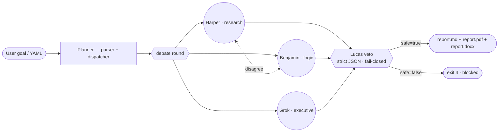
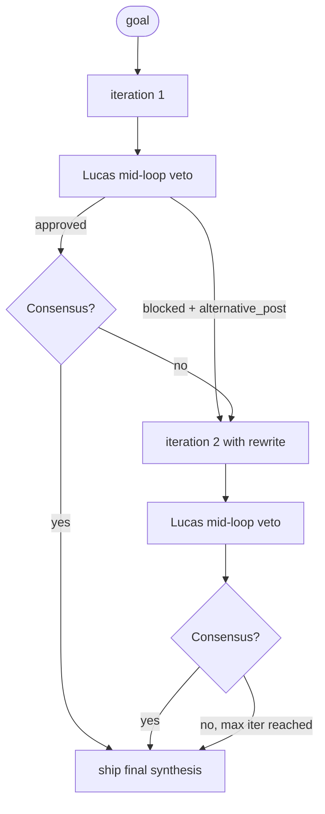

# Debate loop

The default orchestration is a single-pass debate over `debate_rounds`. The
`debate-loop` pattern is the same loop wrapped in an *iteration* — each
iteration runs the full debate, consults Lucas mid-loop, and a Grok consensus
check decides whether to exit early.

## Single-pass (default)



## `debate-loop` (iterative)



The pattern is the right pick when:

- The topic is contested and you want progressive refinement.
- You can tolerate higher token cost in exchange for lower risk of
  inflammatory framing slipping through.
- A single pass tends to land just-okay outputs; you want the model to push
  itself.

YAML:

```yaml
orchestra:
  orchestration:
    pattern: debate-loop
    config:
      iterations: 5            # hard cap on total iterations
      consensus_threshold: 0.80
      max_rounds: 1            # rounds *within* each iteration
```

## Built-in early exit

Each iteration ends with a Grok call that returns one of:

```json
{ "consensus": true,  "remaining_disagreements": [] }
{ "consensus": false, "remaining_disagreements": ["…", "…"] }
```

The loop exits the moment `consensus: true` lands. `iterations` is the upper
bound, not the target.

## When *not* to use this pattern

- **Pure-summarisation topics** — single-pass is faster and cheaper.
- **Very long contexts** — each iteration re-reads the previous synthesis, so
  token cost grows quadratically.
- **Tight latency budgets** — even with early exit, expect 2–3× the token cost
  of a single-pass run.

## See also

- [Dynamic spawn](dynamic-spawn.md) — concurrent fan-out across N sub-tasks.
- [Templates → `orchestra-debate-loop-policy`](../guides/templates.md) — the
  canonical example.
- [Lucas veto](lucas-veto.md) — what the mid-loop veto looks at.
