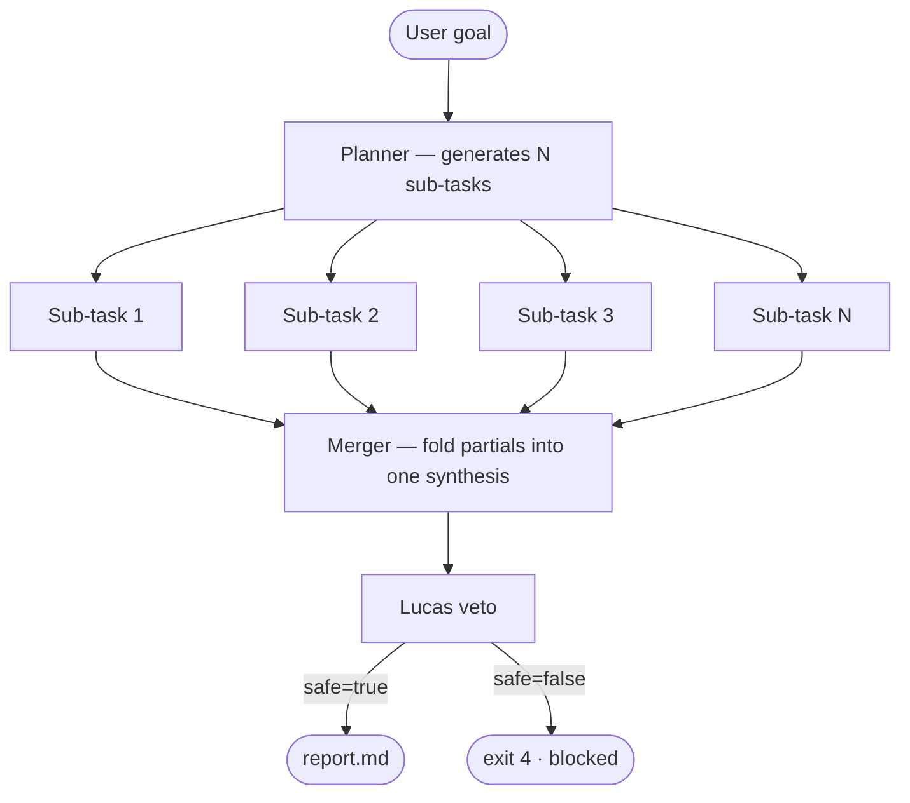

# Dynamic spawn

`dynamic-spawn` is the fan-out pattern. Instead of arguing about one goal,
the planner shards the goal into N sub-goals, runs them concurrently, and
folds the results back into a single synthesis.

Use it when a topic *decomposes naturally* — comparing N vendors, surveying
N regions, profiling N candidate libraries.



## YAML

```yaml
orchestra:
  orchestration:
    pattern: dynamic-spawn
    config:
      max_parallel: 4          # cap concurrent sub-tasks
      shard_strategy: planner  # planner | enumeration | yaml
      merge_role: Grok         # who folds the partials
```

## Shard strategies

| Strategy | When to use |
| --- | --- |
| `planner` | Default. Grok plans the split based on the goal text. |
| `enumeration` | The YAML provides an explicit `items:` list. |
| `yaml` | Each sub-task is fully written in YAML — useful for repro runs. |

## When *not* to use this pattern

- The sub-tasks aren't independent — fan-out shards that need to talk to
  each other belong inside `debate-loop`, not `dynamic-spawn`.
- You're rate-limited on the LLM provider — concurrent sub-tasks multiply
  RPM consumption by `max_parallel`.
- The goal is genuinely small. A 3-sentence question doesn't need
  five parallel agents.

## See also

- [Debate loop](debate-loop.md) — sequential refinement instead of fan-out.
- [Templates → `orchestra-dynamic-spawn`](../guides/templates.md) — the
  canonical example.
