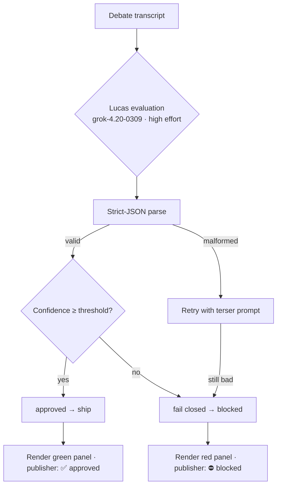

# Lucas veto

The veto step is the framework's safety story. It runs **after** the four-role
debate, takes the full transcript as input, and emits a strict-JSON verdict.
If the verdict is malformed, low-confidence, or times out → **fail closed**.
Nothing ships.

## Verdict shape

```json
{
  "approved": true,
  "confidence": 0.91,
  "reasons": ["No harmful language, bias, or missing perspectives detected."],
  "alternative_post": null
}
```

When `approved=false`, the runner emits a `lucas_veto` event, the dashboard
renders a red banner, the publisher's report prints `⛔ blocked`, and the CLI
exits with code `4` (the dedicated `EXIT_SAFETY_VETO` value).

## Flow



## Configuration

```yaml
safety:
  lucas_veto_enabled: true
  lucas_model: grok-4.20-0309        # only Grok today
  confidence_threshold: 0.85
  max_veto_retries: 1
```

A few defaults are deliberate:

- **High reasoning effort.** Lucas is the only role that pays for `effort=high`
  by default. Mistakes here are expensive; latency isn't.
- **Strict-JSON output.** A regex fallback parser handles the common "model
  wrapped JSON in a code fence" case; everything past that is a hard fail.
- **Fail-closed defaults.** `confidence_threshold: 0.85` blocks anything Lucas
  isn't sure about.
- **Two-pass for combined runs.** When the YAML is `combined: true`, Lucas runs
  a second time on the synthesised content before deploy.

## Patterns that compose around the veto

- **`debate-loop`** runs a *mid-loop* veto each iteration. If Lucas vetoes with
  an `alternative_post`, the next iteration's goal is replaced with the rewrite.
  See [Debate loop](debate-loop.md).
- **`combined`** (Bridge codegen + Orchestra debate) layers two vetoes — one on
  the orchestration synthesis and one on the deployable artefact.
- **`recovery`** wraps any pattern with a degrade-on-rate-limit retry. The veto
  always runs on the *final* output regardless of which model produced it.

## Tracing the veto

When a tracing backend is configured, every veto produces:

- `lucas_evaluation` span — wraps the whole evaluation, includes
  `approved: bool`.
- `veto_decision` span (child) — carries `confidence`, `reasons[]`,
  `blocked_claim`, and `status: "blocked"` when blocked.

See [Guides → Tracing](../guides/tracing.md) for backend setup.

## Auditing past vetoes

Every run's `run.json` snapshot at `$GROK_ORCHESTRA_WORKSPACE/runs/<id>/run.json`
includes the full `veto_report`. The `grok-orchestra trace export <run-id>` CLI
command dumps the events JSON for offline review — useful when you're chasing
why a run blocked.
