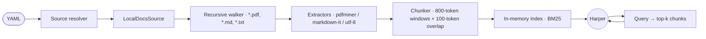

# Local docs

Agent Orchestra can pull from local files (PDF, Markdown, plain text)
**without** sending anything to a third-party search API. This is the
hot path for privacy-sensitive runs and offline laptops.



## Configure in YAML

```yaml
sources:
  - kind: local_docs
    path: ./reference
    glob: "**/*.{pdf,md,txt}"
    max_chunks_per_query: 8
```

`path` is resolved relative to the YAML file's directory. `glob` defaults
to `**/*.pdf`.

## What gets extracted

| Format | Library | Notes |
| --- | --- | --- |
| `.pdf` | `pdfminer.six` | Text only — no OCR. Scanned PDFs need OCR upstream. |
| `.md` | built-in | Front-matter stripped; code fences preserved. |
| `.txt` | built-in | UTF-8, BOM stripped. |

## Extras to install

```bash
pip install "grok-agent-orchestra[search]"      # pdfminer included
```

## Combine with web search

`local_docs` and `web_search` can coexist — Harper queries both and the
fold step interleaves citations. Local citations render as
`[file:report.pdf#page=4]`; web citations as `[web:example.com]`.

## Fully-offline tier

Pair local docs with the Local tier (Ollama):

```yaml
orchestra:
  llm:
    default:
      provider: ollama
      model: llama3.1:8b
sources:
  - kind: local_docs
    path: ./reference
```

Run with no `XAI_API_KEY` / `OPENAI_API_KEY` set. `grok-orchestra doctor`
will report **Local tier: ready**.

## See also

- [Web search](web-search.md) — Tavily integration for the cloud tier.
- [Multi-provider LLM](multi-provider-llm.md) — Ollama + LiteLLM setup.
- Template: [`debate-loop-with-local-docs`](templates.md).
