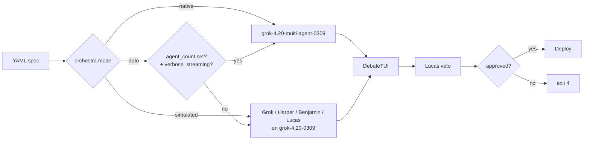
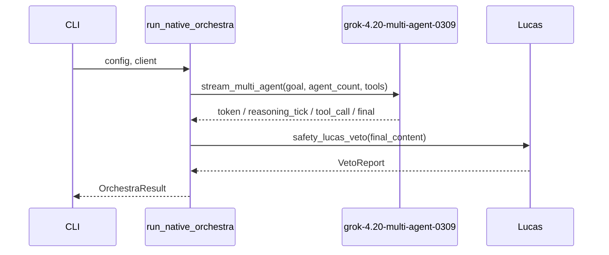
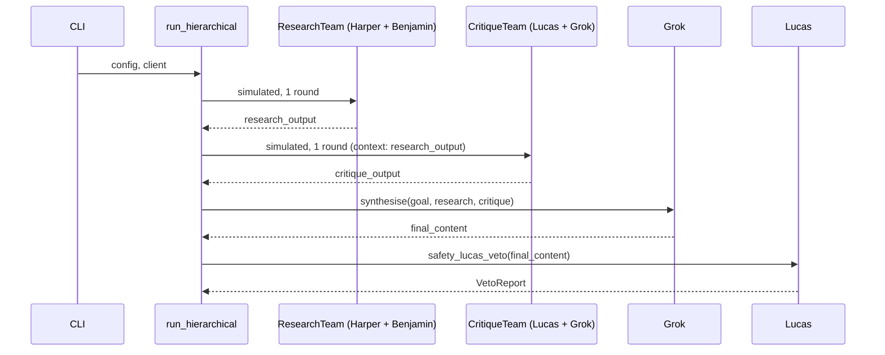
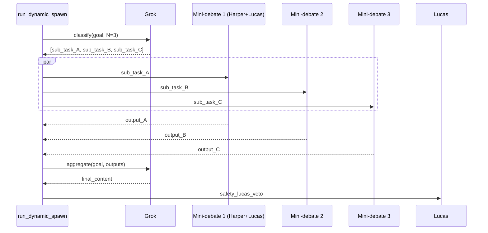
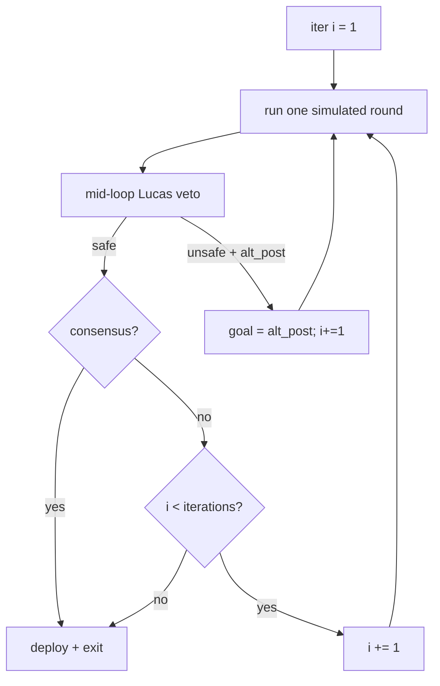
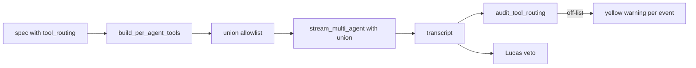
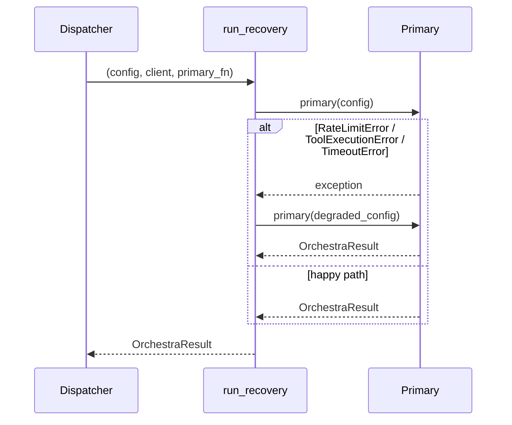
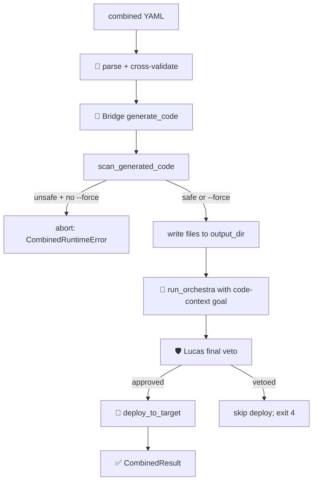

# Orchestra — deep dive

Everything Grok Agent Orchestra does, why it does it, and what each
knob costs. Read top-to-bottom on your first encounter; skim the
table-of-contents after.

- [Two modes](#two-modes)
- [YAML reference](#yaml-reference)
- [Patterns](#patterns)
- [Lucas veto](#lucas-veto)
- [Cost estimation](#cost-estimation)
- [Combined Bridge + Orchestra](#combined-bridge--orchestra)

---

## Two modes



**native** is the xAI multi-agent endpoint: 4 or 16 agents, server-side
role routing, single aggregated stream. Best overall quality.

**simulated** drives a visible round-by-round debate between four
named roles over the single-agent model. Every system prompt, every
role turn, every tool call is exposed — ideal for debugging, audits,
teaching, and playgrounds.

**auto** picks native when you've set both `agent_count` and
`include_verbose_streaming: true`; otherwise simulated.

## YAML reference

### Root

| key         | type     | default | notes                                                    |
|-------------|----------|---------|----------------------------------------------------------|
| `name`      | string   | —       | Short identifier; fallback goal.                         |
| `goal`      | string   | —       | Plain-English instruction the debate satisfies.          |
| `combined`  | bool     | `false` | Enable combined Bridge + Orchestra runtime.              |
| `build`     | object   | —       | Bridge build spec. **Required** when `combined: true`.   |
| `deploy`    | object   | `{}`    | Deploy target. Skipped on veto denial.                   |
| `orchestra` | object   | **req** | The Orchestra block.                                     |
| `safety`    | object   | {defaults} | Safety / veto config.                                  |

### `orchestra` block

| key                         | type    | default      | notes                                                                          |
|-----------------------------|---------|--------------|--------------------------------------------------------------------------------|
| `mode`                      | enum    | `auto`       | `native` / `simulated` / `auto`.                                              |
| `agent_count`               | enum    | derived      | `4` or `16` — derived from `reasoning_effort` when omitted.                    |
| `reasoning_effort`          | enum    | `medium`     | `low` / `medium` / `high` / `xhigh`.                                           |
| `include_verbose_streaming` | bool    | `true`       | Stream reasoning ticks + tool calls into the TUI.                              |
| `use_encrypted_content`     | bool    | `false`      | Playground-only today.                                                         |
| `debate_rounds`             | int     | `2`          | `1..5`. Simulated mode only.                                                   |
| `debate_style`              | enum    | —            | Advertised style only; not override.                                           |
| `agents`                    | array   | canonical    | Named roles; fallback order is Grok → Harper → Benjamin → Lucas.               |
| `orchestration.pattern`     | enum    | `native`     | See [Patterns](#patterns).                                                     |
| `orchestration.config`      | object  | `{}`         | Pattern-specific.                                                              |
| `orchestration.fallback_on_rate_limit` | object | —  | `enabled`, `fallback_model`, `lowered_effort`.                                 |
| `tool_routing`              | object  | `{}`         | Per-agent tool allowlist (patternProperties `^[A-Za-z0-9_-]+$`).               |

### `safety` block

| key                    | type    | default              | notes                                            |
|------------------------|---------|----------------------|--------------------------------------------------|
| `lucas_veto_enabled`   | bool    | `true`               | Keep `true` for anything that ships.             |
| `lucas_model`          | enum    | `grok-4.20-0309`     | Pinned — not user-selectable.                    |
| `confidence_threshold` | number  | `0.75`               | 0..1. Approvals below threshold are downgraded. |
| `max_veto_retries`     | int     | `1`                  | Alt-post rewrite attempts (0..5).                |

### Named roles

| role     | name     | tools (default)                 | output format                                                                 |
|----------|----------|---------------------------------|-------------------------------------------------------------------------------|
| coordinator | Grok    | none                            | 1-3 short paragraphs; ends `resolved: …` on disagreements.                    |
| researcher  | Harper  | `web_search`, `x_search`        | Bulleted findings with URL/handle sources.                                    |
| logician    | Benjamin | none (opt-in `code_execution`) | Cites argument form; ends `verdict: sound / unsound / underdetermined`.       |
| contrarian  | Lucas   | none                            | `Flaw N: … | Risk: … | Counter-evidence: …` blocks; max 3.                   |

## Patterns

Every pattern is a composition on top of the native and simulated
runtime primitives; each pattern file is ≤120 LOC.

### native



### hierarchical



### dynamic-spawn



### debate-loop



### parallel-tools

Identical transport to `native`, plus a post-stream audit:



### recovery



## Lucas veto

Lucas is Orchestra's hero safety feature — the last gate before any
agent-authored content leaves the process. Three design decisions make
the gate robust enough to rely on in production:

1. **One model, one effort, hard-coded.** Every veto call runs Lucas
   on `grok-4.20-0309` at `reasoning_effort="high"`. Operators cannot
   downgrade the reviewer to a cheaper model by mistake.
2. **Strict JSON schema.** The system prompt ends with `Output ONLY
   valid JSON` and a shape specification. The parser strips code
   fences, `json.loads`, then regex-extracts the first `{…}` span as
   a fallback. Any remaining malformed response **fails closed** as
   `safe=False` with `reasons=["parse-error: …"]`.
3. **Low-confidence downgrade.** An approval (`safe=True`) with
   confidence below `safety.confidence_threshold` is converted to
   `safe=False` with reason `low-confidence: X < threshold Y`. The
   threshold defaults to `0.75` and should be raised to `0.85`+ for
   production ships.

### Example — approved

```json
{"safe": true, "confidence": 0.92,
 "reasons": ["No harmful language, bias, or missing perspectives detected."],
 "alternative_post": null}
```

Rendered as a green panel:

```
╭─ Lucas — safety verdict ─╮
│ ✅  Lucas approves       │
│ confidence: 0.92         │
│ notes: · No harmful …    │
╰──────────────────────────╯
```

### Example — vetoed

```json
{"safe": false, "confidence": 0.94,
 "reasons": ["Targets a protected group.",
             "Likely to incite harassment."],
 "alternative_post": "Reframe: here is a respectful, evidence-based take…"}
```

Rendered as a red panel with the rewrite in an inner yellow-bordered
sub-panel. Deploy is blocked. When
`safety.max_veto_retries > 0` and an `alternative_post` is present,
the runtime retries the veto with the rewrite as the new
`final_content` exactly once before giving up. CLI exit code is `4`
on a terminal denial.

## Cost estimation

Rough token ceilings for a single happy-path run. Multiply by your
model's per-token rate for a pricing estimate.

| pattern / mode                    | tokens (≈) | notes                                         |
|-----------------------------------|-----------:|-----------------------------------------------|
| native-4 (medium effort)          |  6–10 k    | baseline                                      |
| native-16 (high effort)           | 25–40 k    | ~4× native-4                                   |
| simulated (4 roles × 2 rounds)    |   8–12 k   | scales linearly with `debate_rounds`          |
| simulated (4 roles × 3 rounds)    |  10–15 k   | adds Harper tool calls + Benjamin code_execution |
| hierarchical                      |  18–25 k   | two 1-round sub-debates + synthesis + veto    |
| dynamic-spawn (N=3)               |  12–18 k   | 1 classify + 6 role calls + synthesis + veto  |
| debate-loop (up to 5 iters)       |  15–40 k   | typically exits in 1-3 iterations             |
| parallel-tools (native-4)         |   6–10 k   | same as native-4                              |
| recovery (no failures)            | baseline   | zero overhead on the happy path               |
| recovery (one degraded retry)     | +4–6 k     | single retry at lowered effort                |
| combined (simulated + Bridge)     | 30–60 k    | Bridge code-gen + Orchestra + veto            |

Every template header lists a specific estimate for that template.
The INDEX at `grok_orchestra/templates/INDEX.yaml` exposes the same
numbers in machine-readable form.

## Combined Bridge + Orchestra



Phases 2–4 render inside **one** `DebateTUI` — the TUI's
`set_phase(label, color)` shifts the header label between stages
without tearing down the `Live` render. Inner runtimes called by the
dispatcher detect an already-active TUI and become transparent
delegates, so no nested `Live` clashes.

