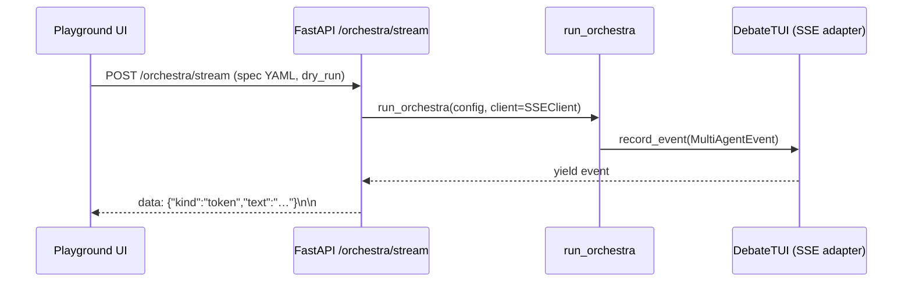

# Playground integration

Notes for wiring Grok Agent Orchestra into the Grok Install Ecosystem
playground — the browser-side experience that lets a visitor watch a
live debate in 2-5 seconds and understand what Orchestra does without
reading a line of docs.

## The "Watch Debate" button

A one-click surface that opens an iframe and streams
`MultiAgentEvent`s from a running Orchestra spec into a live
transcript. The playground already knows how to post to an SSE
endpoint — this section describes the Orchestra-side adapter.



## Server side: SSE adapter

The existing `DebateTUI` abstracts event recording behind four public
methods (`record_event`, `render_reasoning`, `start_role_turn`,
`set_phase`). The playground adapter is a drop-in subclass that
re-broadcasts each event as an SSE line.

```python
# playground/sse_adapter.py
from __future__ import annotations
from collections.abc import Iterator
from queue import SimpleQueue
from grok_orchestra.multi_agent_client import MultiAgentEvent
from grok_orchestra.streaming import DebateTUI


class SSEDebateTUI(DebateTUI):
    """Re-broadcasts recorded events through a queue for SSE streaming."""

    def __init__(self, *args, **kwargs) -> None:
        super().__init__(*args, **kwargs)
        self._queue: SimpleQueue[dict] = SimpleQueue()

    def record_event(self, ev: MultiAgentEvent) -> None:
        super().record_event(ev)
        self._queue.put(
            {
                "kind": ev.kind,
                "text": ev.text,
                "reasoning_tokens": ev.reasoning_tokens,
                "agent_id": ev.agent_id,
                "tool_name": ev.tool_name,
                "timestamp": ev.timestamp,
            }
        )

    def start_role_turn(self, role_name, role_type, round_num, color="cyan"):
        super().start_role_turn(role_name, role_type, round_num, color)
        self._queue.put(
            {"kind": "role_turn", "role": role_name, "role_type": role_type,
             "round": round_num, "color": color}
        )

    def set_phase(self, label: str, color: str = "cyan") -> None:
        super().set_phase(label, color)
        self._queue.put({"kind": "phase", "label": label, "color": color})

    def iter_events(self) -> Iterator[dict]:
        while True:
            event = self._queue.get()
            if event is None:
                return
            yield event
```

```python
# playground/endpoint.py (FastAPI)
from fastapi import FastAPI, Request
from fastapi.responses import StreamingResponse
import threading, yaml
from grok_orchestra.dispatcher import run_orchestra
from grok_orchestra.runtime_native import DryRunOrchestraClient
from grok_orchestra.runtime_simulated import DryRunSimulatedClient
from grok_orchestra.parser import load_orchestra_yaml, resolve_mode
from playground.sse_adapter import SSEDebateTUI

app = FastAPI()


@app.post("/orchestra/stream")
async def stream(request: Request) -> StreamingResponse:
    body = await request.body()
    spec = yaml.safe_load(body)
    # In production: validate + enforce --dry-run on the public tier.
    # load_orchestra_yaml requires a path; we parse via .parser.parse for dicts.
    from grok_orchestra.parser import parse
    config = parse(spec)
    mode = resolve_mode(config)
    client = DryRunOrchestraClient(tick_seconds=0.15) if mode == "native" else DryRunSimulatedClient(tick_seconds=0.15)

    tui = SSEDebateTUI(goal=config.get("goal", ""), agent_count=4)

    def _run() -> None:
        try:
            run_orchestra(config, client=client)
        finally:
            tui._queue.put(None)

    threading.Thread(target=_run, daemon=True).start()

    def _sse() -> Iterator[bytes]:
        for ev in tui.iter_events():
            import json as _json
            yield f"data: {_json.dumps(ev)}\n\n".encode("utf-8")

    return StreamingResponse(_sse(), media_type="text/event-stream")
```

Key properties:
- **Dry-run by default on the public tier.** Never dispatch to a live
  `OrchestraClient` from an unauthenticated endpoint — the playground
  is a marketing surface, not a credits pool.
- **Thread-per-run.** The dispatcher is sync; running it in a worker
  thread lets the SSE response yield as events arrive.
- **Queue sentinel.** `None` terminates `iter_events()` cleanly when
  the run finishes.

## Client side: "Watch Debate" iframe

Minimal HTML for the iframe target. The playground embeds this in a
fixed-size card.

```html
<!-- watch.html -->
<!doctype html>
<meta charset="utf-8">
<style>
  body { background: #111; color: #eee; font: 14px/1.4 ui-monospace, monospace; padding: 12px; }
  .role { margin-top: 10px; font-weight: 600; }
  .token { color: #ddd; }
  .phase { color: #B69EFE; margin: 8px 0; }
  .veto-safe { color: #8ef; }
  .veto-unsafe { color: #f77; }
</style>
<div id="log"></div>
<script type="module">
const spec = await (await fetch("./example.orchestra.yaml")).text();
const res = await fetch("/orchestra/stream", {
  method: "POST", body: spec, headers: { "Content-Type": "application/x-yaml" }
});
const reader = res.body.getReader();
const dec = new TextDecoder();
let buf = "";
while (true) {
  const {done, value} = await reader.read();
  if (done) break;
  buf += dec.decode(value);
  const events = buf.split("\n\n");
  buf = events.pop();
  for (const raw of events) {
    if (!raw.startsWith("data: ")) continue;
    const ev = JSON.parse(raw.slice(6));
    const log = document.getElementById("log");
    if (ev.kind === "role_turn") {
      log.insertAdjacentHTML("beforeend",
        `<div class="role" style="color:${ev.color}">▶ ${ev.role} · ${ev.role_type} · r${ev.round}</div>`);
    } else if (ev.kind === "phase") {
      log.insertAdjacentHTML("beforeend",
        `<div class="phase">${ev.label}</div>`);
    } else if ((ev.kind === "token" || ev.kind === "final") && ev.text) {
      log.insertAdjacentHTML("beforeend",
        `<span class="token">${ev.text.replace(/</g, "&lt;")}</span>`);
    }
  }
}
</script>
```

## Marketplace badges from spec

Every pattern and every mode gets a coloured pill in the listing —
bind the colour table directly off the CLI source so badges and CLI
stay in sync.

```ts
// marketplace/badges.ts
export const PATTERN_COLOURS = {
  native:         "cyan",
  hierarchical:   "green",
  "dynamic-spawn": "magenta",
  "debate-loop":   "yellow",
  "parallel-tools": "blue",
  recovery:       "red",
} as const;

export const MODE_COLOURS = {
  native:    "cyan",
  simulated: "violet",
  auto:      "slate",
} as const;

export const SAFETY_BADGE = "🛡 Lucas-certified";
```

Listings combine `pattern` + `mode` + `SAFETY_BADGE` when
`safety.lucas_veto_enabled` is true in the spec. The marketplace's
Orchestra entry should also surface the `INDEX.yaml`
`marketplace_badges` array verbatim.
