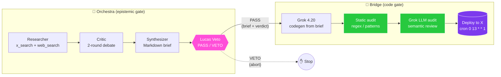
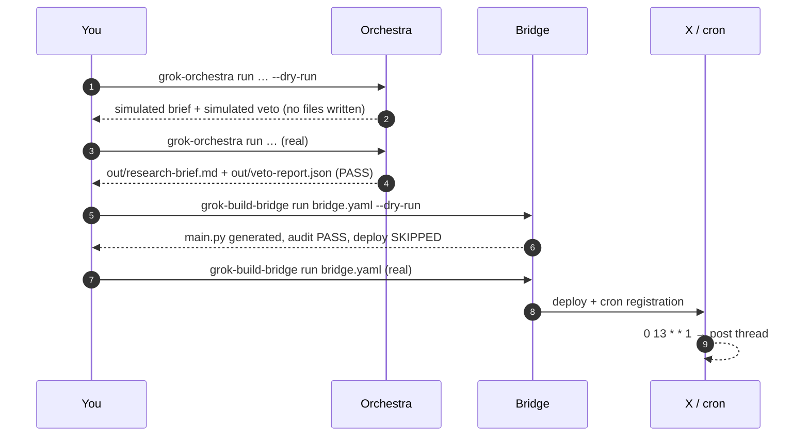

# Orchestra → Bridge: Weekly Research Thread Publisher

End-to-end example of the **Grok Agent Orchestra → Grok Build Bridge** handoff.
Orchestra runs a multi-agent debate to produce a Lucas-vetted research brief;
Bridge turns that brief into a safely-deployed weekly X thread. Two
independent safety gates, two artefacts, one publishable agent.



## Files in this folder

| File                  | Tool       | Purpose                                                                 |
| --------------------- | ---------- | ----------------------------------------------------------------------- |
| `orchestra-spec.yaml` | Orchestra  | Multi-agent debate + Lucas veto gate. Outputs `out/research-brief.md`.  |
| `bridge.yaml`         | Bridge     | Generates the X publisher from the brief. Honours the Lucas verdict.    |
| `README.md`           | (this)     | Workflow walkthrough, dry-run loop, production checklist.               |

## Prerequisites

```bash
pip install grok-build-bridge grok-agent-orchestra
cp ../../.env.example .env                  # then fill in the keys below
```

Required environment variables:

| Variable              | Purpose                                            | Where to get it          |
| --------------------- | -------------------------------------------------- | ------------------------ |
| `XAI_API_KEY`         | Powers every Orchestra agent + Bridge codegen.     | https://console.x.ai     |
| `X_BEARER_TOKEN`      | Used by the deployed agent to post threads.        | https://developer.x.com  |
| `GROK_INSTALL_HOME`   | Optional. Path to a local `grok-install` clone.    | (local checkout)         |

> **Bridge-only mode:** if Orchestra isn't installed, Bridge still runs
> standalone — hand-author `out/research-brief.md` and an `out/veto-report.json`
> containing `{"verdict": "PASS"}` and skip to Step 2.

## The full flow at a glance

```bash
# 0. one-time setup
cd examples/orchestra-bridge
mkdir -p out

# 1. validate both specs before spending a single token
grok-orchestra validate orchestra-spec.yaml
grok-build-bridge validate bridge.yaml

# 2. dry-run Orchestra — debates the topic but does NOT publish artefacts
grok-orchestra run orchestra-spec.yaml \
    --set topic="Progress in RLHF" \
    --out ./out \
    --dry-run

# 3. real Orchestra run — produces the brief + Lucas verdict
grok-orchestra run orchestra-spec.yaml \
    --set topic="Progress in RLHF" \
    --out ./out

# 4. dry-run Bridge — generates main.py, runs the safety audit, no deploy
grok-build-bridge run bridge.yaml --dry-run

# 5. real Bridge run — Lucas check + safety audit + deploy + cron schedule
grok-build-bridge run bridge.yaml
```

Steps 2 and 4 cost nothing irreversible. Steps 3 and 5 are the only ones that
spend non-trivial tokens or change the live deployment.

## Step 1 — Run Orchestra (debate + research)

```bash
# Validate the spec offline first (no API calls):
grok-orchestra validate orchestra-spec.yaml

# Dry-run — exercises the full pipeline without writing artefacts to ./out
# or contacting the X API. Cheap (~10% of a real run) and safe to repeat:
grok-orchestra run orchestra-spec.yaml \
    --set topic="Progress in RLHF" \
    --out ./out \
    --dry-run

# Real run:
grok-orchestra run orchestra-spec.yaml \
    --set topic="Progress in RLHF" \
    --out ./out
```

Orchestra walks four phases:

1. **research** — `researcher` surfaces 8-12 candidate findings via `x_search`
   + `web_search`, attaches primary sources.
2. **debate** — `critic` challenges every finding for two rounds; `researcher`
   rebuts. Surviving findings move forward.
3. **synthesize** — `synthesizer` merges into a publication-ready
   `research-brief.md` (TL;DR + 5-7 evidence sections).
4. **veto_gate** — `lucas_veto` reads the final brief and emits PASS or VETO.
   On VETO, Orchestra exits non-zero and Bridge is **never** invoked.

Artefacts after a successful run:

```
out/
├── research-brief.md          ← human-readable brief, consumed by bridge.yaml
├── debate-transcript.json     ← full agent log, useful for audit trails
└── veto-report.json           ← {"verdict": "PASS"} on success
```

Quick sanity check before moving on:

```bash
jq -r .verdict out/veto-report.json     # → "PASS"
head -20 out/research-brief.md          # eyeball the TL;DR
```

## Step 2 — Run Bridge (safe deployment)

Only proceed once `out/veto-report.json` shows `"verdict": "PASS"`.

```bash
# Validate the bridge.yaml against its JSON schema (no API calls):
grok-build-bridge validate bridge.yaml

# Dry-run — generates main.py, runs BOTH safety layers, but does NOT post:
grok-build-bridge run bridge.yaml --dry-run

# Promote to a real deploy when the dry-run is clean:
grok-build-bridge run bridge.yaml

# If you ever need to ship past a known-benign safety finding (rare,
# requires an explicit override):
grok-build-bridge run bridge.yaml --force
```

What Bridge does, end to end:

1. **build** — Calls Grok 4.20 with the prompt from `bridge.yaml`, embedding
   the Orchestra brief as the authoritative content source. Generates one
   `main.py`.
2. **safety_scan (static)** — Regex/AST pass blocks `eval`, `exec`,
   `shell=True`, `os.system`, `pickle`, hard-coded secrets, and missing
   timeouts.
3. **safety_scan (LLM)** — Grok-in-the-loop semantic review: would this code
   misbehave at runtime? Prompt-injection vectors? Missing retries?
4. **lucas_veto check** — With `safety.lucas_veto_enabled: true`, Bridge
   reads `out/veto-report.json`. Anything other than `PASS` aborts deploy.
5. **deploy** — Hands off to `grok-install`'s `deploy_to_x` runtime. The
   `0 13 * * 1` schedule posts every Monday at 13:00 UTC.

## Dry-run workflow (recommended before every real run)

`--dry-run` exists in both tools and they compose:



| `--dry-run` does                                    | `--dry-run` does NOT                       |
| --------------------------------------------------- | ------------------------------------------ |
| Hit `xai-sdk` and consume tokens (Orchestra: ~10%, Bridge: full build cost). | Write final artefacts to disk (Orchestra). |
| Run every safety check end-to-end.                  | Register cron schedules.                   |
| Print the audit verdict + cost summary.             | Hand off to `grok-install` / X API.        |
| Surface schema/config errors that `validate` misses.| Post anything to your X handle.            |

The combined dry-run loop costs **<$0.20** and surfaces 95% of issues before a
real deploy. Make it muscle memory.

## The two safety gates, working together

| Gate                    | Owner       | What it catches                                                                                       | Failure mode                |
| ----------------------- | ----------- | ----------------------------------------------------------------------------------------------------- | --------------------------- |
| **Lucas veto**          | Orchestra   | Epistemic / alignment / reputational risk in the **brief** (unsourced claims, bias, stale citations).  | Hard abort. Bridge never runs. |
| **Bridge static audit** | Bridge      | Pattern-level risk in the **generated code** (unsafe APIs, secrets, missing timeouts).                 | Hard abort. Deploy never ships. |
| **Bridge LLM audit**    | Bridge      | Semantic risk in the **generated code** (prompt-injection, runaway loops, ambiguous behaviour).        | Hard abort. Deploy never ships. |

Why three gates and not one:

- **Lucas alone** can clear a brief that the generated code then mishandles
  (e.g. forgets to enforce 280-char post limits).
- **Static audit alone** catches obvious unsafe APIs but misses logic flaws
  that *look* fine on a regex pass.
- **LLM audit alone** is good at semantics but can hallucinate clean reviews
  on subtle pattern matches.

Defence-in-depth: a release ships only when the **source material and the
executable** both pass review by independent reviewers. The probability of a
false-pass surviving all three is the product of three small numbers.

## Production tips

### Scheduling

- The example fires `0 13 * * 1` (Mondays 13:00 UTC). For US/EU office hours,
  prefer Tue-Thu mornings — engagement is empirically higher than Mon AM.
- X rate limits cap automated posting. Stagger multi-handle deployments by ≥5
  minutes; do not collide with manual posting from the same account.
- Refresh the Orchestra brief on a **separate, more frequent** cadence
  (e.g. daily) than the Bridge publisher (weekly). The deployed agent reads
  `out/research-brief.md` at runtime, so brief refreshes propagate without a
  redeploy.
- Skip holidays / quiet periods by gating `main.py` on a calendar file rather
  than rebuilding the agent each season.

### Monitoring

- **Exit codes are the truth.** Wire both tools' exit codes to PagerDuty /
  Slack: non-zero from `grok-orchestra` = brief failed peer review; non-zero
  from `grok-build-bridge` = code failed audit. Either signal is actionable.
- **Brief staleness alarm.** Alert if `out/research-brief.md` mtime is older
  than `2 × refresh_interval` — the deployed agent will keep posting stale
  content otherwise.
- **Veto rate as a quality metric.** Track Lucas veto frequency over time. A
  sudden spike usually means a topic shift that exceeds the criteria;
  investigate before loosening rules.
- **Audit findings as a debug log.** Bridge persists each safety finding under
  `.grok-build-bridge/audits/`. Grep that directory when investigating
  regressions — many "X API errors" trace back to a finding the audit caught
  weeks earlier.
- **Post-deploy smoke test.** After every real `grok-build-bridge run`, fetch
  the most recent post via the X API and assert the cited URL is reachable
  (`curl -sI <url> | head -1`).

### Cost control

- Set `safety.max_tokens_per_run` per spec (the example caps at `30000`). The
  ceiling fails closed before a runaway loop drains your xAI budget.
- Tune `reasoning_effort` per agent. `xhigh` is reserved for Lucas (the gate
  cost is worth the assurance); use `medium` for the synthesizer; the
  researcher and critic should be `high`. Dropping any of them to `low`
  measurably degrades brief quality — verify with a dry-run diff.
- The combined Orchestra + Bridge real-run cost should sit at **~$1.35** per
  topic refresh + deploy. If a run consistently exceeds $2, inspect the
  debate transcript for circular argumentation (a sign of unfocused critic
  prompts).
- Cache the brief. Since Bridge reads it at runtime, one Orchestra run can
  fan out to N deploys at zero additional cost. Multi-handle / multi-language
  publishers should share a single `out/research-brief.md`.
- Use `--dry-run` before every parameter sweep. The 10% dry-run cost saves
  the 100% real-run cost when an experiment is misconfigured.

## Re-running on a new topic

The brief is the only artefact tied to a specific topic. To rotate topics
without rerunning Bridge:

```bash
# 1. Refresh the brief with a new Orchestra run (~$0.80).
grok-orchestra run orchestra-spec.yaml --set topic="New topic here" --out ./out

# 2. Bridge already deployed — the agent reads out/research-brief.md at
#    runtime, so the next scheduled tick picks up the new content.
```

If the new run yields a VETO, the previously-deployed agent keeps running on
the previous brief — no risky degraded mode.

## Troubleshooting

| Symptom                                                                       | Fix                                                                                                  |
| ----------------------------------------------------------------------------- | ---------------------------------------------------------------------------------------------------- |
| `bridge.yaml` aborts with `lucas_veto_enabled requires out/veto-report.json`  | Run Orchestra first, or hand-author a `{"verdict": "PASS"}` file for a smoke test.                   |
| Static safety scan flags a generated regex as `unsafe`                        | Inspect the finding in the Bridge console; tighten `grok_prompt` constraints, then re-`--dry-run`.   |
| `grok-orchestra: command not found`                                           | `pip install grok-agent-orchestra`, or skip Orchestra and author the brief + verdict manually.       |
| Schedule fired but no post appeared on X                                      | Check `X_BEARER_TOKEN` scope — needs `tweet.write` and a Pro-tier app.                                |
| `--dry-run` succeeds but the real run fails on `safety_scan`                  | The LLM audit is non-deterministic by ~5%; re-run, and if it persists tighten the `grok_prompt`.     |
| Cost per run > $2                                                             | Lower `reasoning_effort` on `researcher` / `critic`, or trim `max_tokens` per agent in the Orchestra spec. |

## What this example does NOT cover

- Multi-account fan-out (one brief → multiple X handles). Use a separate
  `bridge.yaml` per handle and share the same `out/research-brief.md`.
- Real-time refresh. Both halves are batch — Orchestra ad-hoc, Bridge weekly.
  For real-time, see the `x-trend-analyzer` template instead.
- Custom Lucas criteria. Edit `veto_criteria` in `orchestra-spec.yaml`, or
  point `LUCAS_VETO_RULES` at a longer ruleset YAML before running Orchestra.
